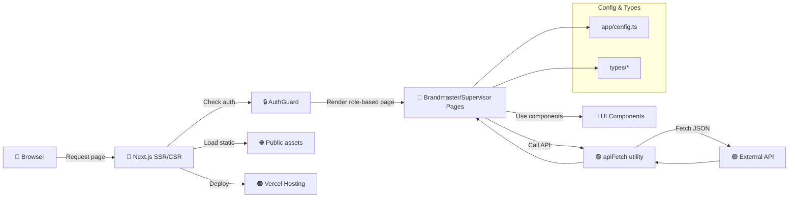

# 🌐 Next.js Brandmaster Dashboard

A **Next.js (TypeScript) web application** for Brandmaster and Supervisor dashboards.  
This SPA/SSR app provides role-based pages, interactive dashboards, reports, and data visualizations with reusable UI components and serverless API calls.

---

## 📦 Project Structure
```
app/
├─ layout.tsx                    # App Router layout
├─ page.tsx                      # Main entry page
├─ config.ts                     # App-level configuration (API base URL)
├─ globals.css                   # Global styles
├─ favicon.ico                   # App favicon
├─ AuthGuard.tsx                 # Route-level authentication guard
├─ Login/                        # Login page
│  └─ page.tsx
├─ NotAuthorized/                # 403 unauthorized page
│  └─ page.tsx
├─ MyActivity/                   # Shared activity tracking page
│  ├─ MyActivityPage.tsx
│  └─ page.tsx
├─ Admin/                        # Admin panel
│  ├─ AdminPanel.tsx
│  └─ page.tsx
├─ Brandmaster/                  # Brandmaster role pages
│  ├─ bmDashboard/
│  │  ├─ BmDashboard.tsx
│  │  └─ page.tsx
│  ├─ actionDetails/
│  │  ├─ actionDetails.tsx
│  │  └─ page.tsx
│  ├─ stats/
│  │  ├─ stats.tsx
│  │  └─ page.tsx
│  ├─ myData/
│  │  ├─ MyDataPage.tsx
│  │  └─ page.tsx
│  └─ helpMe/
│     ├─ HelpMePage.tsx
│     └─ page.tsx
└─ Supervisor/                   # Supervisor role pages
   ├─ svDashboard/
   │  ├─ SvDashboard.tsx
   │  └─ page.tsx
   ├─ tpDashboard/
   │  ├─ TpDashboard.tsx
   │  └─ page.tsx
   ├─ actionPlanner/
   │  ├─ ActionPlannerPage.tsx
   │  ├─ ActionPlannerCard.tsx
   │  ├─ CreateActionDialog.tsx
   │  ├─ page.tsx
   │  └─ README.md
   ├─ myShops/
   │  ├─ myShops.tsx
   │  └─ page.tsx
   ├─ myTargets/
   │  └─ page.tsx
   ├─ myTeam/
   │  ├─ myTeamPage.tsx
   │  └─ page.tsx
   └─ excelGenerator/
      └─ page.tsx

components/
├─ ActionCard.tsx                 # Generic action card component
├─ BmActionCard.tsx               # Brandmaster-specific action card
├─ TpActionCard.tsx               # Territory Planner action card
├─ CasActionDialog.tsx            # CAS action dialog
├─ TpActionDetailsDialog.tsx      # Territory Planner action details
├─ EditActionDialog.tsx           # Edit action dialog
├─ MapPicker.tsx                  # Interactive map picker (Leaflet)
├─ DatePickerInput.tsx            # Date picker input component
├─ TimeInputs.tsx                 # Time input components
├─ AddressInput.tsx               # Address input component
├─ AnimatedTitle.tsx              # Animated title component
├─ LoadingScreen.tsx              # Loading state component
├─ ErrorBoundary.tsx              # Error boundary component
├─ contextMenu.tsx                # Context menu component
└─ ui/                            # shadcn/ui primitives
   ├─ button.tsx
   ├─ input.tsx
   ├─ card.tsx
   ├─ dialog.tsx
   ├─ table.tsx
   ├─ select.tsx
   ├─ label.tsx
   ├─ calendar.tsx
   ├─ popover.tsx
   ├─ accordion.tsx
   ├─ progress.tsx
   └─ sonner.tsx                  # Toast notifications

hooks/
└─ useAnimatedTitle.ts            # Custom hook for animated titles

utils/
├─ apiFetch.ts                    # Centralized API wrapper
├─ datestuff.ts                   # Date manipulation utilities
└─ colors.ts                      # Color constants and helpers

lib/
└─ utils.ts                       # Generic utility functions (cn, etc.)

types/
├─ ActionRelated.ts               # Action-related type definitions
├─ AuthMe.ts                      # Authentication types
├─ MessageRes.ts                  # Message response types
├─ myBms.ts                       # Brandmaster types
├─ Shops.ts                       # Shop types
├─ taget.ts                       # Target types
├─ tpStatsSample.ts               # Territory Planner stats types
├─ UpdateAction.ts                # Action update types
├─ viewTypes.ts                   # View type definitions
└─ apiStuff/
   ├─ objects/                    # API object type definitions
   │  ├─ brandmaster.types.ts
   │  ├─ event.types.ts
   │  ├─ products.types.ts
   │  ├─ shop.types.ts
   │  ├─ team.types.ts
   │  └─ territory.types.ts
   └─ responses/                  # API response type definitions
      ├─ AllShopsResponse.ts
      ├─ AuthResponse.ts
      ├─ BrandmasterStatsResponse.ts
      ├─ MyAction.types.ts
      ├─ MyActivityResponse.ts
      ├─ MyBmsActionsResponse.ts
      ├─ MyCasActionsResponse.ts
      ├─ MyDataResponse.ts
      ├─ MyTeamTargetsResponse.ts
      ├─ ShopsResponse.ts
      └─ TeamCasActionsResponse.ts

public/                           # Static assets
├─ file.svg
├─ globe.svg
├─ next.svg
├─ vercel.svg
└─ window.svg

Configuration Files:
├─ next.config.ts                 # Next.js configuration (API rewrites)
├─ tsconfig.json                  # TypeScript configuration
├─ postcss.config.mjs             # PostCSS configuration
├─ components.json                # shadcn/ui configuration
├─ vercel.json                    # Vercel deployment configuration
└─ package.json                   # Dependencies and scripts
```

---

## 🏗️ System Architecture

### Main Components

| Layer | Components | Responsibility |
|-------|------------|----------------|
| **Routing & Layout** 🔵 | `app/layout.tsx`, `app/page.tsx`, App Router | Nested routing & SSR/SSG |
| **Authentication** 🔒 | `AuthGuard.tsx` | Protects role-based pages |
| **Brandmaster Pages** 🔵 | `/app/Brandmaster/...` | Dashboards, action details, reports, stats, help |
| **Supervisor Pages** 🔵 | `/app/Supervisor/...` | Dashboards (SV/TP), action planner, shops, targets, team, Excel generator |
| **Admin Pages** 🔵 | `/app/Admin/...` | Admin panel functionality |
| **Shared Pages** 🔵 | `/app/MyActivity/...` | Activity tracking across roles |
| **UI Components** 🔹 | `components/*`, `components/ui/*` | Reusable primitives (shadcn/ui) & composite widgets |
| **Custom Hooks** 🪝 | `hooks/useAnimatedTitle.ts` | Reusable React hooks |
| **Utilities** 🟣 | `utils/apiFetch.ts`, `utils/datestuff.ts`, `utils/colors.ts`, `lib/utils.ts` | API wrapper, helpers, date utils, color utilities |
| **Types & Config** 🟢 | `types/*`, `app/config.ts` | Domain models, API types (objects/responses), app-level configuration |
| **Static Assets** 🌐 | `public/` | Images, icons, SVG assets |
| **Hosting & Deployment** 🟠 | Vercel | Serverless deployment, CDN delivery |

---

### 🔄 Data & Interaction Flow



**Highlights**:

- **Component-based UI:** atomic and composite components

- **Next.js App Router:** nested layouts and route protection

- **Central API wrapper:** apiFetch handles all external calls

- **TypeScript domain models:** ensures type safety

- **Serverless deployment:** hosted on Vercel with static asset CDN


⚡ **Key Technologies**

- **Next.js 15** (App Router, SSR/SSG)
- **React 19** + **TypeScript 5**
- **Tailwind CSS 4** (with PostCSS)
- **shadcn/ui** - Component library (Radix UI primitives)
- **Framer Motion** - Animation library
- **Leaflet** + **React Leaflet** - Interactive maps
- **Recharts** - Data visualization and charts
- **date-fns** + **Luxon** - Date manipulation
- **Sonner** - Toast notifications
- **Lucide React** - Icon library
- **Vercel** - Serverless hosting & deployment


📌 **Notes**

- **Role-based routing:** Brandmaster, Supervisor (SV/TP), and Admin modules with protected routes
- **Layout system:** Global layout wraps all nested pages and manages global styles
- **Authentication:** AuthGuard ensures protected routes based on login state and user roles
- **Component architecture:** Split into primitives (shadcn/ui components) and composite widgets
- **API integration:** External API calls centralized via `utils/apiFetch.ts` with proxy rewrites in `next.config.ts`
- **Type safety:** Comprehensive TypeScript types organized by domain (objects, responses, domain models)
- **UI library:** Built on shadcn/ui with Radix UI primitives and Tailwind CSS styling
- **Static assets:** Served from `/public` using Vercel CDN
- **Custom hooks:** Reusable React hooks for common functionality (e.g., animated titles)
- **Map integration:** Leaflet-based map picker for location selection
- **Data visualization:** Recharts for dashboard charts and statistics
