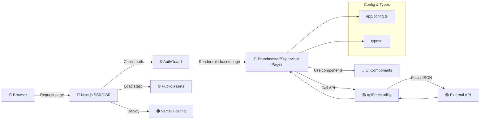

# 🌐 Next.js Brandmaster Dashboard

A **Next.js (TypeScript) web application** for Brandmaster and Supervisor dashboards.  
This SPA/SSR app provides role-based pages, interactive dashboards, reports, and data visualizations with reusable UI components and serverless API calls.

---

## 📦 Project Structure
```
app/
├─ layout.tsx # App Router layout
├─ page.tsx # Main entry page
├─ AuthGuard.tsx # Route-level authentication guard
├─ Brandmaster/ # Brandmaster-specific pages & components
├─ Supervisor/ # Supervisor-specific pages & components
├─ Login/ # Login page
├─ NotAuthorized/ # 403 page
components/
├─ ActionCard.tsx
├─ BmActionCard.tsx
├─ MapPicker.tsx
├─ DatePickerInput.tsx
├─ TimeInputs.tsx
├─ AddressInput.tsx
├─ LoadingScreen.tsx
├─ contextMenu.tsx
└─ ui/ # UI primitives library (button, input, card, table...)
utils/
├─ apiFetch.ts # API wrapper
├─ datestuff.ts # Date helpers
├─ colors.ts # Color constants
lib/
├─ utils.ts # Generic helper functions
app/config.ts # App-level config
types/ # Domain type definitions
public/ # Static assets
next.config.ts # Next.js config
tsconfig.json
postcss.config.mjs
vercel.json
package.json
```

---

## 🏗️ System Architecture

### Main Components

| Layer | Components | Responsibility |
|-------|------------|----------------|
| **Routing & Layout** 🔵 | `app/layout.tsx`, `app/page.tsx`, App Router | Nested routing & SSR/SSG |
| **Authentication** 🔒 | `AuthGuard.tsx` | Protects role-based pages |
| **Brandmaster Pages** 🔵 | `/app/Brandmaster/...` | Dashboards, action details, reports, stats |
| **Supervisor Pages** 🔵 | `/app/Supervisor/...` | Dashboards, shops, targets, team |
| **UI Components** 🔹 | `components/*`, `components/ui/*` | Reusable primitives & composite widgets |
| **Utilities** 🟣 | `utils/apiFetch.ts`, `utils/datestuff.ts`, `lib/utils.ts` | API wrapper, helpers, date utils |
| **Types & Config** 🟢 | `types/*`, `app/config.ts` | Domain models, app-level configuration |
| **Static Assets** 🌐 | `public/` | Images, icons, other static files |
| **Hosting & Deployment** 🟠 | Vercel | Serverless deployment, CDN delivery |

---

### 🔄 Data & Interaction Flow



**Highlights**:

- **Component-based UI:** atomic and composite components

- **Next.js App Router:** nested layouts and route protection

- **Central API wrapper:** apiFetch handles all external calls

- **TypeScript domain models:** ensures type safety

- **Serverless deployment:** hosted on Vercel with static asset CDN


⚡ **Key Technologies**

- Next.js (App Router, SSR/SSG)

- **React + TypeScript**

- **Vercel serverless hosting**

- **PostCSS:** styling pipeline

- **Utility modules:** ```apiFetch, datestuff, lib/utils```


📌 **Notes**

- Role-based pages: Brandmaster and Supervisor modules

- Layout wraps all nested pages and manages global styles

- AuthGuard ensures protected routes based on login state

- Components are split into primitives (ui/*) and composite widgets

- External API calls are centralized via utils/apiFetch.ts

- Static assets served from /public using Vercel CDN
